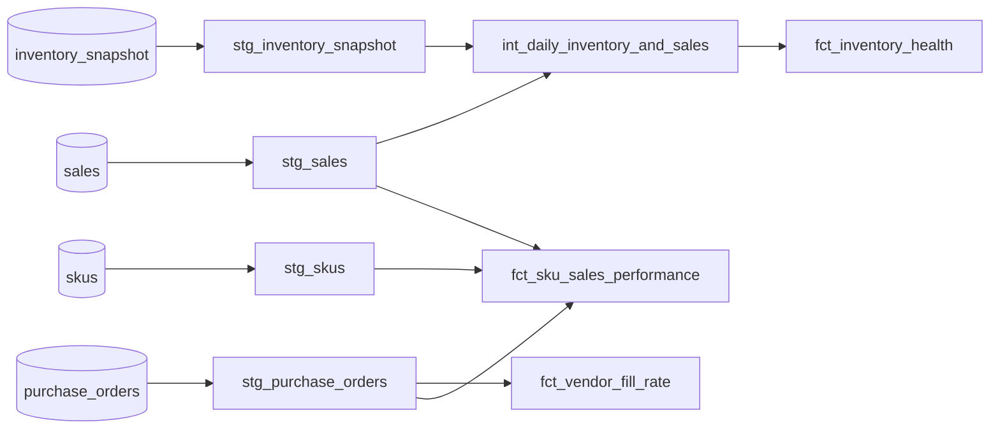

# Supply Chain Analytics — dbt Project

A layered dbt project that models core supply-chain KPIs — vendor fill rate,
on-time delivery, in-stock rate, days of supply, and sell-through — from raw
purchase-order, inventory, and sales data.

Runs locally on DuckDB with no cloud accounts required, and is written in
portable SQL so it can target Snowflake with a profile change only.

## Highlights

- **Layered modeling** — `staging` → `intermediate` → `marts`, following
  dbt's recommended project structure.
- **Data tests** — `unique`, `not_null`, and `relationships` tests on seeds
  and models (35 tests, all passing).
- **Documentation** — model and column descriptions, with a generated data
  dictionary and lineage graph via `dbt docs`.
- **Window functions** — trailing 28-day average daily sales, trailing
  30-day in-stock rate, and `RANK()` for sell-through.
- **Safe division** — `NULLIF` guards wherever a denominator can be zero.
- **Warehouse-portable SQL** — no engine-specific syntax.

## Lineage



## Models

| Layer | Model | Grain | Description |
|---|---|---|---|
| Staging | `stg_skus` | SKU | Product attributes, typed |
| Staging | `stg_purchase_orders` | PO line | Adds `was_on_time` and `was_short_shipped` flags |
| Staging | `stg_inventory_snapshot` | SKU / DC / day | Daily on-hand quantity |
| Staging | `stg_sales` | SKU / DC / day | Daily units sold |
| Intermediate | `int_daily_inventory_and_sales` | SKU / DC / day | Inventory joined to sales, with trailing 28-day average daily sales |
| Mart | `fct_vendor_fill_rate` | Vendor | Fill rate and on-time rate, trailing 90 days |
| Mart | `fct_inventory_health` | SKU / DC / day | Trailing 30-day in-stock rate and days of supply |
| Mart | `fct_sku_sales_performance` | SKU | Sell-through rate and catalog rank |

## Sample data

Four seed CSVs stand in for source-system extracts: 6 SKUs across 5
categories, 3 vendors, 2 distribution centers, and 30 days of daily
inventory and sales history.

## Getting started

Requires Python 3.9+.

```bash
git clone https://github.com/em-tw-ng/SCM-analytics-dbt.git
cd SCM-analytics-dbt
pip install dbt-duckdb
```

Create `~/.dbt/profiles.yml`:

```yaml
supply_chain_analytics:
  target: dev
  outputs:
    dev:
      type: duckdb
      path: supply_chain_analytics.duckdb
      threads: 4
```

Then build and test:

```bash
dbt seed     # load sample data
dbt run      # build all models
dbt test     # run data tests
dbt docs generate && dbt docs serve   # browse docs and lineage graph
```

### Running on Snowflake

Install `dbt-snowflake` and replace the profile with a Snowflake target
(`type: snowflake`, plus account, user, role, warehouse, database, schema).
No model changes are needed.

## Roadmap

- Add `dbt_utils` (surrogate keys, date spine)
- Custom singular tests (e.g. on-hand quantity is never negative)
- Incremental materialization for `fct_inventory_health`
- A BI dashboard on top of the marts layer
